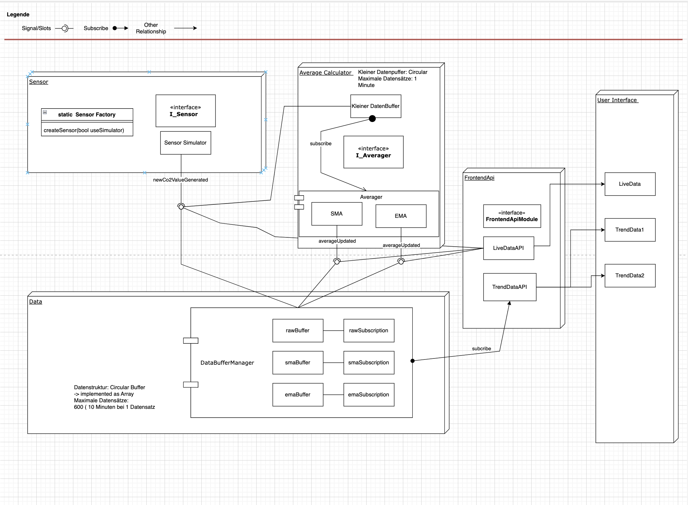

# BreathTrack CO2

## 1. Das Projekt

Das Projekt „BreathTrack CO2“ wurde umgesetzt, und die Anforderungen wurden nach bestem Wissen und Gewissen erfüllt. Als kreative Erweiterung wurde eine **Trendanzeige** hinzugefügt, die historische Datenwerte in Form von Graphen darstellt.

### System Design

Das System wurde auf Basis einer modularen Architektur entwickelt, die eine klare Trennung zwischen Backend und Frontend gewährleistet. Das Backend kümmert sich um die Erfassung, Verarbeitung und Speicherung der CO2-Sensordaten, während das Frontend für die Visualisierung dieser Daten zuständig ist. Die Trendanzeige erweitert das System um die Möglichkeit, vergangene Datenverläufe grafisch darzustellen. Die untenstehende Grafik veranschaulicht die Architektur des Systems:

## 2. Weitere Infos

a. Es gibt eine Notion-Webseite, auf der weitere README-Dateien mit erklärenden Bildern eingefügt sind:  
[Notion - Dokumentation mit Bildern](https://all-the-emotions.notion.site/Documents-With-Images-d234a2bab97e43c3ae876005a5353f96?pvs=4)

b. Dieselben README-Dateien sind auch im Ordner des Repos unter `/READMEs` verfügbar.

## 3. Repository

Das Repository kann ohne Weiteres geklont werden:  
[GitHub - BreathTrack CO2](https://github.com/Sebastian-Mueller-F/BreathTrack-C02.git)

## 4. Infos zur Ausführung

### Projektkonfiguration und Build-Prozess

- Öffnen Sie das Projekt über die `CMakeLists.txt`, um die Konfiguration und den Build-Prozess nachzuvollziehen. Dieser Ansatz stellt sicher, dass auch die Ausgabe von `qDebug`-Statements, die zur besseren Nachvollziehbarkeit des Codes enthalten sind, sichtbar ist.
- Das Projekt ist mit **Qt 6.x** kompatibel, jedoch **nicht** mit Qt 5.x, da bestimmte Komponenten, wie beispielsweise die Timeline im Frontend, die neueren Versionen von Qt erfordern.

Es wurden zwar ausführbare Linux-Versionen bereitgestellt, die aber nicht ausgiebig getestet werden konnten, um eine klare Funktion sicherzustellen. Der beste Weg ist es daher, das Projekt über Qt zu öffnen und auf Linux zu kompilieren und zu builden. Dies wurde mehrfach auf zwei verschiedenen Linux-Geräten erfolgreich getestet.

## 5. Feedback

Ich freue mich auf Feedback, besonders zur Architektur und zum Software-Design.
